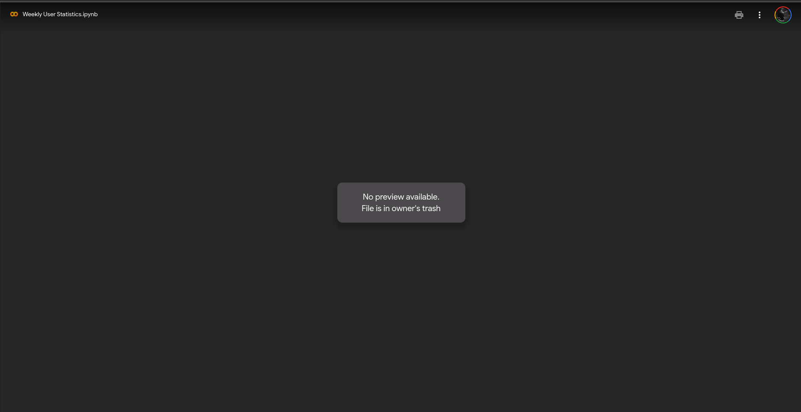

# Creating a Use Case

To create a new use case, use the below command&#x20;

```bash
npm run usecase:create
```

if you are using yarn package manager

```bash
yarn usecase:create
```

It gives you a prompt to fill the details of the use-case,

<figure><figcaption></figcaption></figure>

> Note:  If the use-case name contains two words, then separate it with \_ or \<space>

