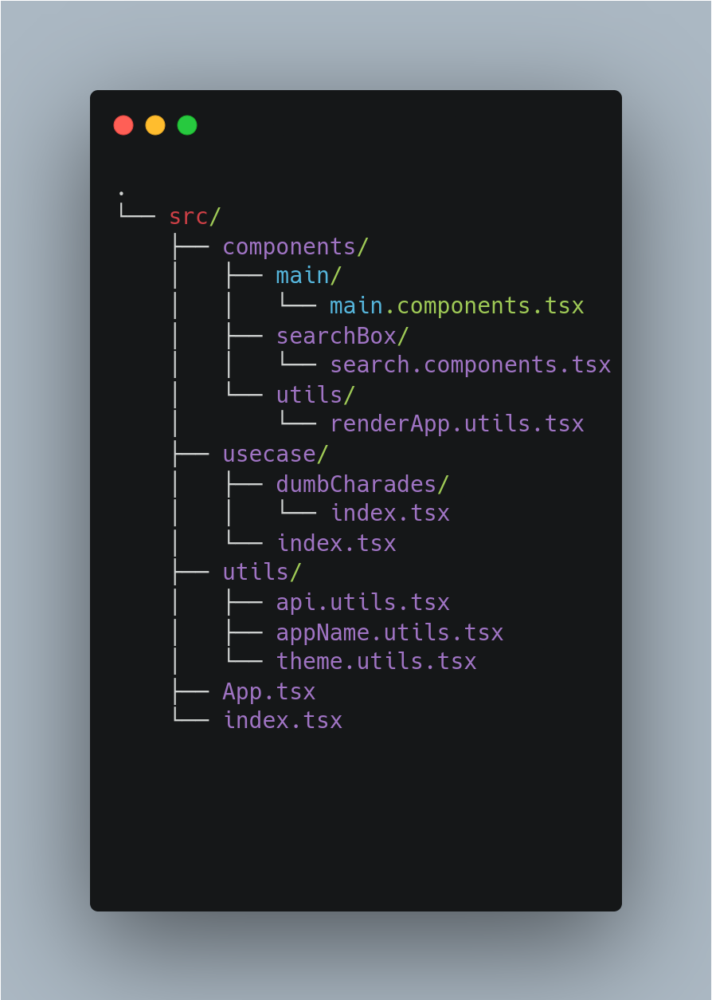

# Folder Structure

<figure><figcaption>
Folder Structure
</figcaption></figure>

## ./src/index.ts

index.js is the traditional and actual entry point for all node apps. Here in React it just has code of what to render and where to render.

## ./src/App.tsx

It has the root component of the react app because every view and component is handled with hierarchy in React, which is the top component in the hierarchy. This gives you the feel that you maintain hierarchy in your code starting from App.tsx

## **./src**/components

It contains share common components throughout the apps.

### /main/main.component.tsx

It is the main component that mounts in google search.

### /searchBox/searchbox.component.tsx

It is the search bar that is used in the App.tsx

### **/utils/renderApps.utils.tsx**

&#x20;Helper function that renders Custom Apps according to the data received from Backend.

## ./src/utils

It contains helper functions throughout the app.

### **/api.utils.ts**

It contains API functions to check and send data to the backend.

### **/appName.utils.ts**

It contains all App Names present in the use cases.

### /themes.utils.ts

It contains the theming configuration for Material-UI

## ./src/usecases

It contains all the use-cases present in the app.

### /index.tsx

It's a common import for all of the usecases
